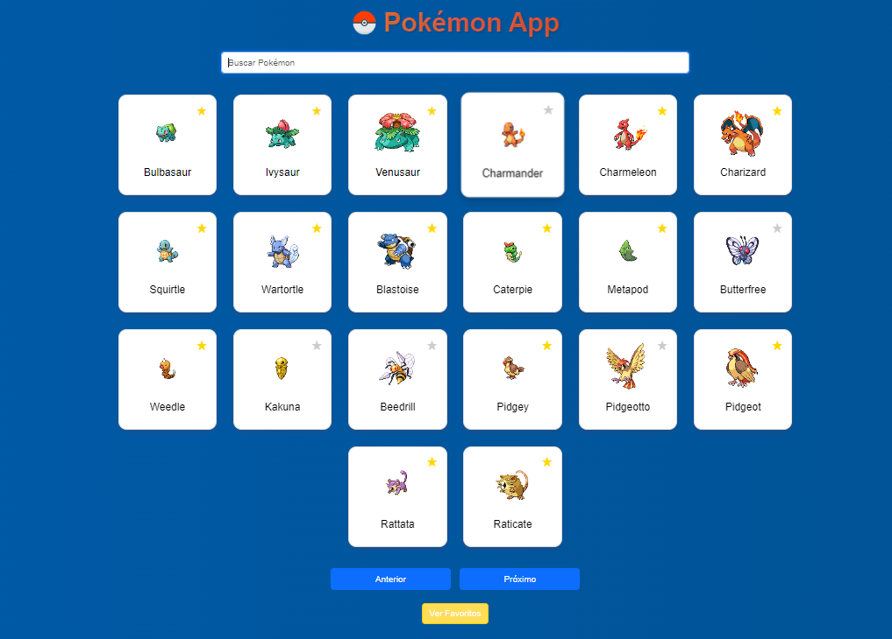
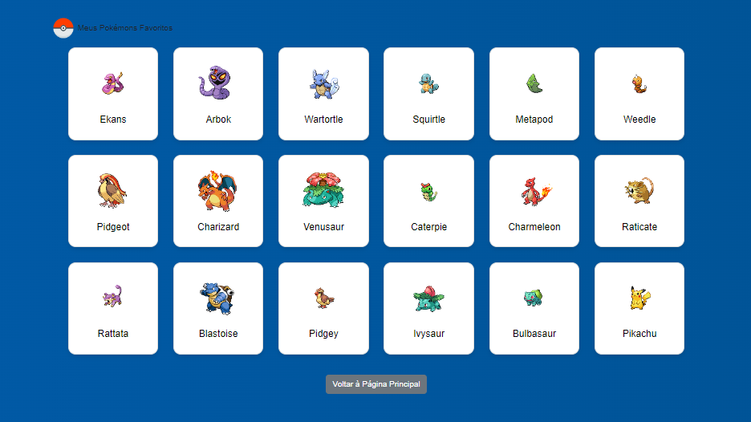

# Pokémons Favoritos

Um aplicativo web simples para gerenciar uma lista de Pokémons favoritos. Utilize a PokeAPI para buscar informações sobre os Pokémons e armazená-los no `localStorage` do navegador.





## Funcionalidades

- **Listar Pokémons Favoritos**: Visualize seus Pokémons favoritos em um layout responsivo.
- **Adicionar aos Favoritos**: Permite que os usuários adicionem Pokémons à sua lista de favoritos.
- **Remover dos Favoritos**: Remova Pokémons da lista de favoritos.
- **Interface Atraente**: Design moderno com gradientes e sombras.

## Tecnologias Utilizadas

- HTML
- CSS
- JavaScript
- [PokeAPI](https://pokeapi.co/) para buscar dados dos Pokémons

## Como Usar

1. **Clone o repositório**:

   ```bash
   git clone https://github.com/DaviRibeiro06/pokemon-list.git
